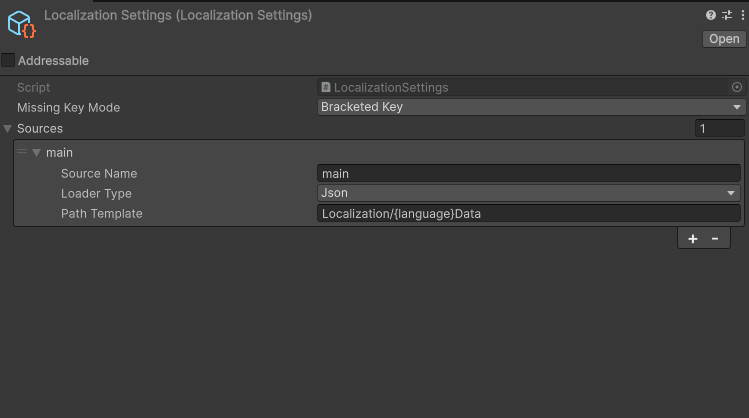

# KidzDev Unity Localization

Lightweight localization for Unity 6+. Load from **JSON** or **ScriptableObjects**, plug in any async loader, and drive TMP_Text automatically.

## Installation

```
https://github.com/knabsiraphop/kidzdev-unity-localization.git#v1.0.1
```

Requires UniTask (OpenUPM: `com.cysharp.unitask`).

## Initialization Workflow

The whole system follows one pipeline — **configure sources → load a language → read text → release**:

```
Configure()                 register where strings come from (loaders + path templates)
    │
    ▼
SetLanguageSync / Async()   load every source for the chosen language, then fire OnLanguageChanged
    │
    ▼
GetText("key")              read a string (LocalizationHandler does this automatically for TMP_Text)
    │
    ▼
Release()                   clear all loaded entries
```

### Recommended: configure from a settings asset

1. Create the asset via **Tools ▸ Localization ▸ Create Settings** (it lands at `Resources/LocalizationSettings.asset`).
2. In the Inspector set **Missing Key Mode** and add one or more **Sources** (name, loader type, path template).

   

3. At startup, apply it with a single call:

```csharp
async UniTaskVoid Start() {
    LocalizationSystem.Configure();                                   // reads Resources/LocalizationSettings
    await LocalizationSystem.SetLanguageAsync(GameLanguage.English, destroyCancellationToken);

    string greeting = LocalizationSystem.GetText("greeting");
    string welcome  = LocalizationSystem.GetTextFormat("welcome_format", playerName);
}
```

`Configure()` is a no-op when no settings asset exists, so it is always safe to call.

### Alternative: configure entirely in code

If you don't want a settings asset, register sources by hand — everything else is identical:

```csharp
LocalizationSystem.AddSource("main", new ResourcesJsonLoader(), "Localization/{language}MainData");
await LocalizationSystem.SetLanguageAsync(GameLanguage.English, destroyCancellationToken);
```

### Switching language & cleanup

```csharp
await LocalizationSystem.SetLanguageAsync(GameLanguage.Thai, destroyCancellationToken); // reloads all sources
LocalizationSystem.Release();                                                           // clears entries
```

> `SetLanguage*` re-loads **every registered source** each call and fires `OnLanguageChanged` afterward, so any `LocalizationHandler` on screen refreshes itself with no extra code.

## Staged Loading (Resources → Addressables)

A common production flow is to show base strings from `Resources` immediately, then layer remote strings on top once Addressables is ready. Because sources are named and the later source wins on key collision, this is just *add a source and reload the same language*:

```csharp
// Phase 1 — instant, from Resources (bundled with the build)
LocalizationSystem.Configure();
await LocalizationSystem.SetLanguageAsync(currentLanguage, ct);

// Phase 2 — after your Addressables system is initialized
LocalizationSystem.AddSource("remote", new MyAddressablesLoader(), "Localization/{language}Remote");
await LocalizationSystem.SetLanguageAsync(LocalizationSystem.CurrentLanguage, ct);
// remote keys now override the bundled ones; LocalizationHandler refreshes automatically
```

See [Custom Loader](#custom-loader) for the `MyAddressablesLoader` implementation.

## Data Formats

**JSON** (`Resources/Localization/EnglishMainData.json`):
```json
[
  { "key": "greeting", "content": "Hello!" },
  { "key": "welcome_format", "content": "Welcome, {0}!" }
]
```

**ScriptableObject** — create via `Assets > Create > KidzDev > Localization > Table`.

## Custom Loader

```csharp
public class MyAddressablesLoader : ILocalizationLoader {
    public IReadOnlyList<LocalizationEntry> Load(string path) => throw new NotSupportedException();
    public async UniTask<IReadOnlyList<LocalizationEntry>> LoadAsync(string path, CancellationToken ct) {
        var handle = Addressables.LoadAssetAsync<LocalizationTable>(path);
        var table = await handle.WithCancellation(ct);
        return table.entries;
    }
}
```

## TMP_Text Auto-Refresh

Add `LocalizationHandler` to any TMP_Text GameObject (or use extensions):

```csharp
myTmpText.SetLocalizedKey("greeting");           // attaches LocalizationHandler, auto-refreshes
myTmpText.SetLocalizedText("greeting");          // one-shot, no auto-refresh
```

## Multiple Sources

```csharp
LocalizationSystem.AddSource("ui",   new ResourcesJsonLoader(),  "Localization/{language}UIData");
LocalizationSystem.AddSource("items",new ResourcesTableLoader(), "Localization/{language}ItemData");
// All sources load in parallel; later-added sources override earlier keys on collision.
await LocalizationSystem.LoadAsync(GameLanguage.English);
```

## Missing Key Behavior

```csharp
LocalizationSystem.MissingKeyMode = MissingKeyMode.BracketedKey; // [key]  (default)
LocalizationSystem.MissingKeyMode = MissingKeyMode.RawKey;       // key
LocalizationSystem.MissingKeyMode = MissingKeyMode.Empty;        // ""
```

## Authorship

Built with [Claude Code](https://claude.com/claude-code), Anthropic's AI coding agent: the design, direction, and review are human ([@knabsiraphop](https://github.com/knabsiraphop)); most of the implementation code was written by Claude under that direction. All code is original — nothing copied from or bundled with third-party sources.
